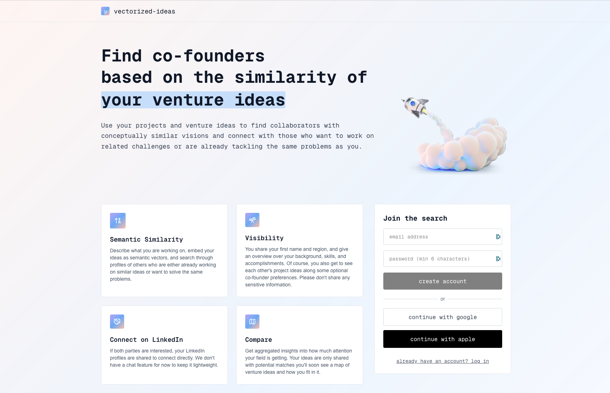

# vectorized-ideas (work in progress)
A minimal, free co-founder matching platform that leverages the semantic similarity of users' venture ideas, reseach-, or side projects to connect people tackling the same challenges.
To be hosted on serverless functions, performs all compute in supabase.

    

*Preview*